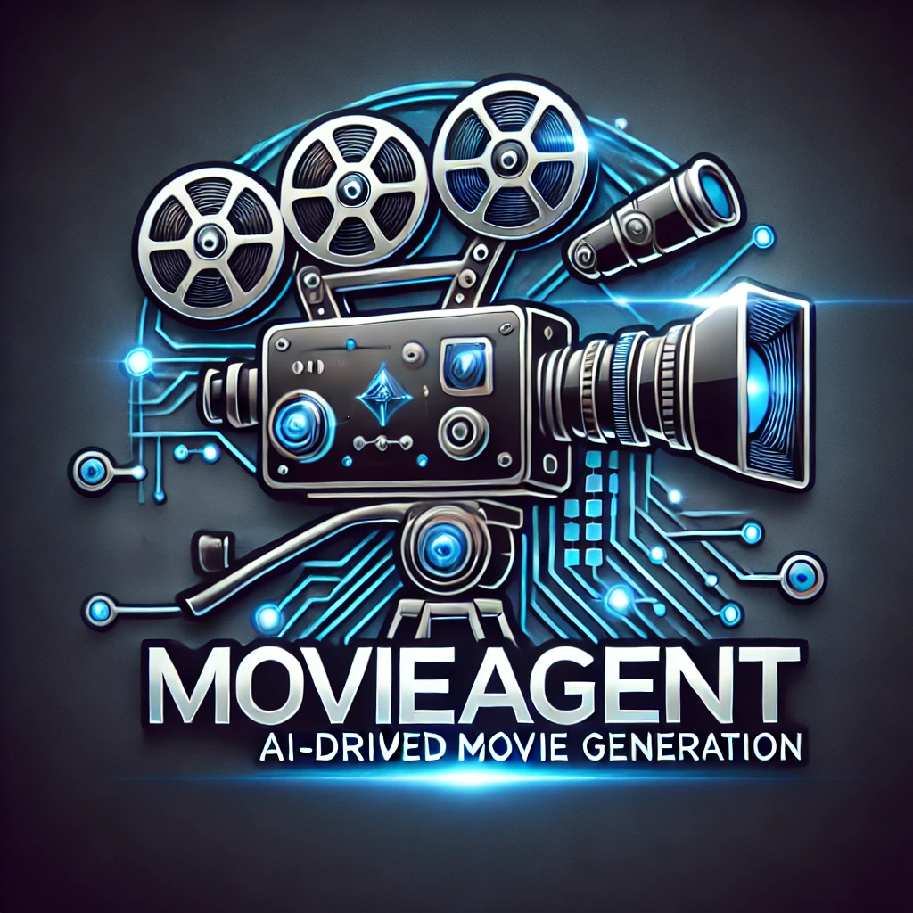
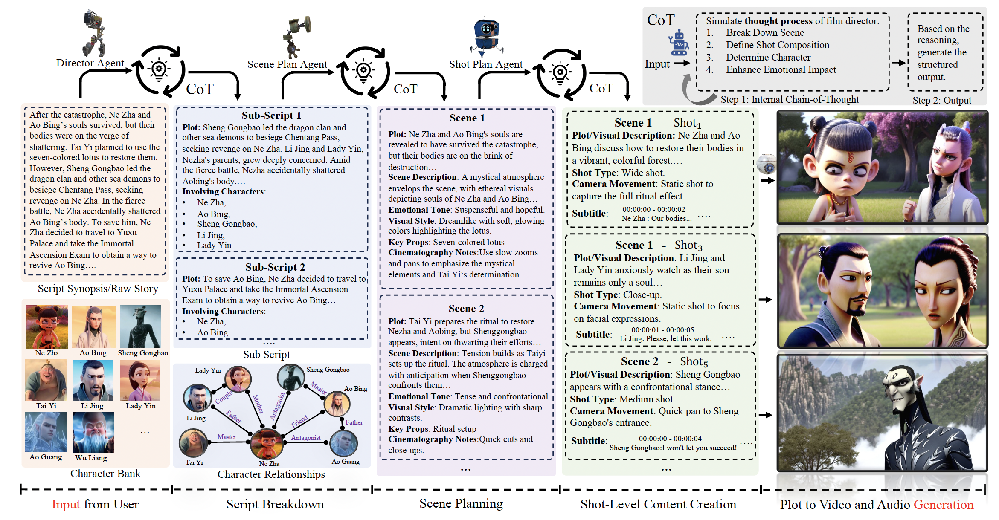

# MovieAgent


<table align="center">
  <tr>
    <td></td>
    <td>
      <h3>MovieAgent: Automated Movie Generation via Multi-Agent CoT Planning</h3>
      <a href="https://weijiawu.github.io/MovieAgent/">
        
      </a> &ensp;
      <a href="https://arxiv.org/abs/2503.07314">
        
      </a>
    </td>
  </tr>
</table>


## :notes: **Updates**

<!--- [ ] Mar. 13, 2024. Release the train code in **three month**.-->

- [x] Mar. 18, 2024. Release the inference code (Our method is training-free.).
- [x] Mar. 10, 2025. Rep initialization (No code).


## 🐱 Abstract
Existing long-form video generation frameworks lack automated planning and often rely on manual intervention for storyline development, scene composition, cinematography design, and character interaction coordination, leading to high production costs and inefficiencies. To address these challenges, we present MovieAgent, an automated movie generation via multi-agent Chain of Thought (CoT) planning. MovieAgent offers two key advantages: 1) We firstly explore and define the paradigm of automated movie/long-video generation. Given a script and character bank, our MovieAgent can generates multi-scene, multi-shot long-form videos with a coherent narrative, while ensuring character consistency, synchronized subtitles, and stable audio throughout the film. 2) MovieAgent introduces a hierarchical CoT-based reasoning process to automatically structure scenes, camera settings, and cinematography, significantly reducing human effort. By employing multiple LLM agents to simulate the roles of a director, screenwriter, storyboard artist, and location manager, MovieAgent streamlines the production pipeline. Our framework represents a significant step toward fully automated movie production, bridging the gap between AI-driven video generation and high-quality, narrative-consistent filmmaking.

---

<p align="center">
  
<br>
</p>


<a name="installation"></a>
## :hammer: Installation

1. Clone the repository.

```bash
git clone 
cd MovieAgent
```

2. Install the environment.
```bash
conda create -n MovieAgent python=3.8
conda activate MovieAgent
pip install -r requirements.txt
```


<a name="usage"></a>
## Model and Data Preparation


First, you need to prepare the `script synopsis of movie` and  `photo,audio of character` as follow:


```
dataset/
    movie name/
        script_synopsis.json
        character_list/
            character 1/
                photo_1.jpg
                photo_2.jpg
                audio.wav
            character 2/
            ...
```


Then, you need to configure the `open_api_key` and `model name` in `movie_agent/script/run.sh`.

The reasoning process using agents may involve various image and video generation models. Most models can be automatically downloaded, while a few require **manual configuration**, such as StoryDiffusion and ROICtrl for **character customization**:

### Supported Model Zoo  

| LLM (Language Model) | Image Gen. (Image Generation) | Video Gen. (Video Generation) |
|----------------------|------------------------------|------------------------------|
| GPT4-o               | ROICtrl                   | SVD/HunyuanVideo_I2V             |


### Image Gen. Model - ROICtrl 
You can train by yourself following the [Guidance](https://github.com/showlab/MovieAgent/tree/main/movie_agent/models/ROICtrl).

Or download our weight directly:

```
# download the ED lora for movie: Frozen II
cd movie_agent/weight
git lfs install
git clone https://huggingface.co/weijiawu/MovieAgent-ROICtrl-Frozen

# download the ROICtrl adapter
wget -P ROICtrl_sdv14_30K https://huggingface.co/guyuchao/ROICtrl/resolve/main/ROICtrl_sdv14_30K.safetensors
```

ROICtrl requires an environment with CUDA 12.1 and PyTorch 2.4.

### Image-Video Gen. Model - HunyuanVideo_I2V 
Step 1: Download HunyuanVideo-I2V model
```bash
python -m pip install "huggingface_hub[cli]"

# Use the huggingface-cli tool to download HunyuanVideo-I2V model in HunyuanVideo-I2V/ckpts dir.
cd movie_agent/weight
mkdir HunyuanVideo_I2V 
huggingface-cli download tencent/HunyuanVideo-I2V --local-dir ./HunyuanVideo_I2V

# Download Text Encoder.
cd HunyuanVideo_I2V
huggingface-cli download xtuner/llava-llama-3-8b-v1_1-transformers --local-dir ./text_encoder_i2v
huggingface-cli download openai/clip-vit-large-patch14 --local-dir ./text_encoder_2
```


### Generate Movie/Long Video

Generate the long video with MovieDirector:
```bash
cd movie_agent
sh script/run.sh
```


## Citation

If you find our repo useful for your research, please consider citing our paper:

    @misc{wu2025movieagent,
          title={Automated Movie Generation via Multi-Agent CoT Planning}, 
          author={Weijia Wu, Zeyu Zhu, Mike Zheng Shou},
          year={2025},
          eprint={2503.07314},
          archivePrefix={arXiv},
          primaryClass={cs.CV}
    }

## 🤗Acknowledgements
- Thanks to [Diffusers](https://github.com/huggingface/diffusers) for the wonderful work and codebase.
- Thanks to [Evaluation-Agent](https://github.com/Vchitect/Evaluation-Agent) for the wonderful work and codebase.


